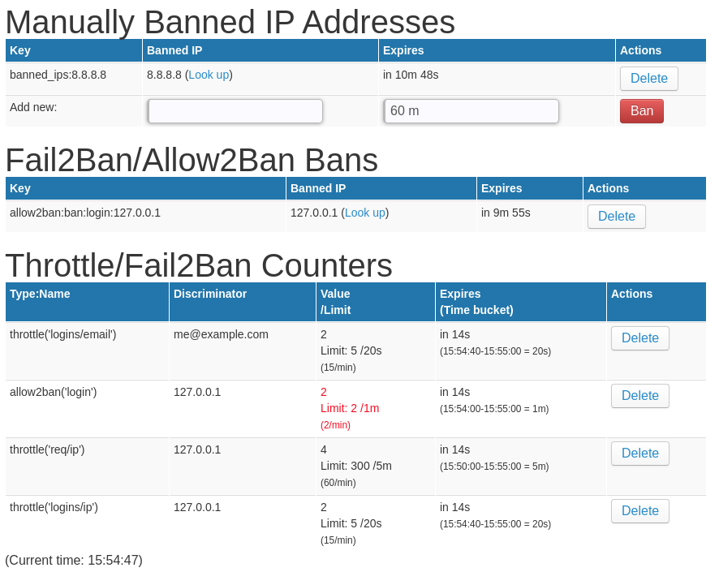
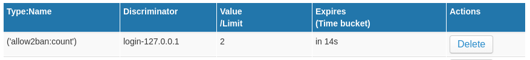

# [Rack::Attack](https://github.com/kickstarter/rack-attack) Admin Dashboard  [](https://badge.fury.io/rb/rack_attack_admin)

Lets you see the current state of all throttles and bans. Delete existing keys/bans. Manually add bans.



Inspired by: https://www.backerkit.com/blog/building-a-rackattack-dashboard/

## Installation

Add this line to your application's `Gemfile`:

```ruby
gem 'rack_attack_admin'
```

Add this line to your application's `config/routes.rb`:

```ruby
mount RackAttackAdmin::Engine, at: '/admin/rack_attack'
```

## Usage

Go to http://localhost:3000/admin/rack_attack in your browser!

You can also use the provided read-only command-line command, `rake rack_attack_admin:watch` instead of the web interface:
```
+-------------------------------+--------------------+
| Banned IP                     | Previous (5 s ago) |
+-------------------------------+--------------------+
| allow2ban:ban:login-127.0.0.1 |                    |
+-------------------------------+--------------------+
+----------------------------------------------------------------------------------+---------------+--------------------+
| Key                                                                              | Current Count | Previous (5 s ago) |
+----------------------------------------------------------------------------------+---------------+--------------------+
| ('allow2ban:count'):login-127.0.0.1                                              | 2             | 1                  |
| throttle('logins/ip'):127.0.0.1                                                  | 1             |                    |
| throttle('logins/email'):me@example.com                                          | 1             |                    |
| throttle('req/ip'):127.0.0.1                                                     | 2             | 1                  |
+----------------------------------------------------------------------------------+---------------+--------------------+
```


## Fail2Ban/Allow2Ban

In order to allow your Fail2Ban/Allow2Ban rules to be introspected by this app, you must define them
slightly differently than the upstream [Rack::Attack
documentation](https://github.com/kickstarter/rack-attack#fail2ban) tells you
to define them:

If you have an Allow2Ban filter in a blocklist like this:

```ruby
  blocklist('login:allow2ban') do |req|
    Rack::Attack::Allow2Ban.filter("login-#{req.ip}", maxretry: 5, findtime: 1.minute, bantime: 10.minutes) do
      # The count for the IP is incremented if this return value is truthy.
      is_login.(req)
    end
  end
```

, you can change it to this equivalent definition:

```ruby
  blocklist('login:allow2ban') do |req|
    def_allow2ban('login', limit: 5, period: 1.minute, bantime: 10.minutes)
    allow2ban(    'login', req.ip) do
      is_login.(req)
    end
  end
```

`def_fail2ban`/`def_allow2ban` save your configuration in a hash (by name, _without_ discriminator in it), much the same as
`throttle` does.

`fail2ban`/`allow2ban` methods are simply wrappers for `Rack::Attack::Allow2Ban.filter` that look up and use the options from the definition (that matches the given name).

This has the following advantages:
- It actually stores your Fail2Ban rule so that we can look it up later
- It provides an API and options that are more similar to and consistent with regular `throttle`
    commands:
    ```ruby
    # Compare:
    def_allow2ban('login', limit: 5, period: 1.minute, bantime: …)
    allow2ban('login', discriminator) do
      # Return truthy value to increment counter
    end
    # allow2ban returns true if counter reaches limit

    throttle('logins/email', limit: 5, period: 1.minute) do |req|
      discriminator.(req)
    end
    ```
- You can use the familiar `limit` and `period` options instead of `maxretry` and `findtime`
  options, respectively.
- You don't have to interpolate the discriminator into a string like you do with the standard
  `Fail2Ban.filter` syntax.


This is completely optional. If you choose not to define them this way, it will still show your
fail2ban counter keys and value; it just won't be able to find the matching rule, and therefore
won't be able to show what the limit or time bucket is for that counter key. So instead of showing
the limit for `allow2ban('login')` like it shows in the screenshot above, it will fall back to
just showing what little it can show about that key:



## Redis cache store compatibility

This has been tested with `Rack::Attack.cache.store` set to an instance of:
- `Redis::Store` from the fantastic [redis-store](https://github.com/redis-store/redis-store) gem.
  (Which is used by the `ActiveSupport::Cache::RedisStore` (from redis-activesupport/redis-rails
  gems))
- `ActiveSupport::Cache::RedisCacheStore` (provided by Rails 5.2+)

## Contributing

Bug reports and pull requests are welcome on GitHub at https://github.com/TylerRick/rack_attack_admin.
